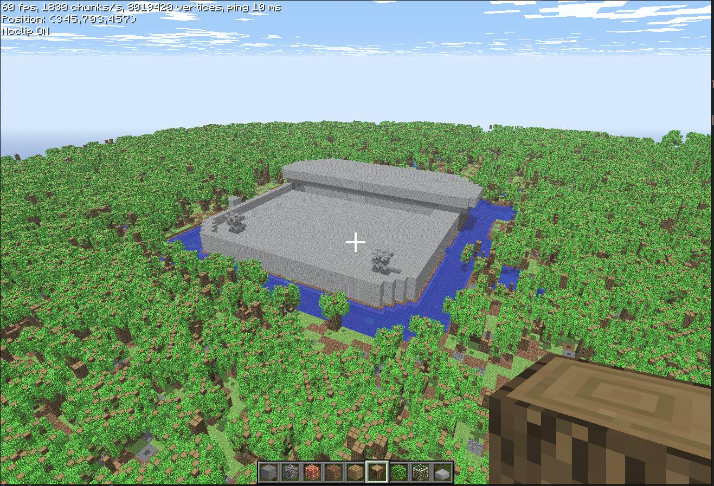
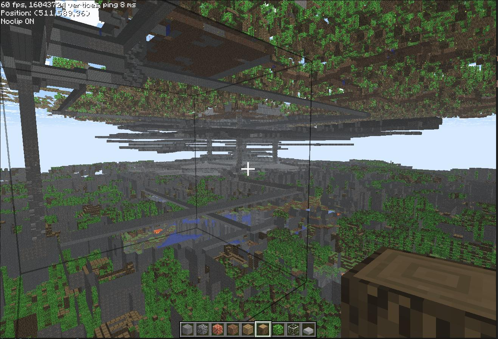
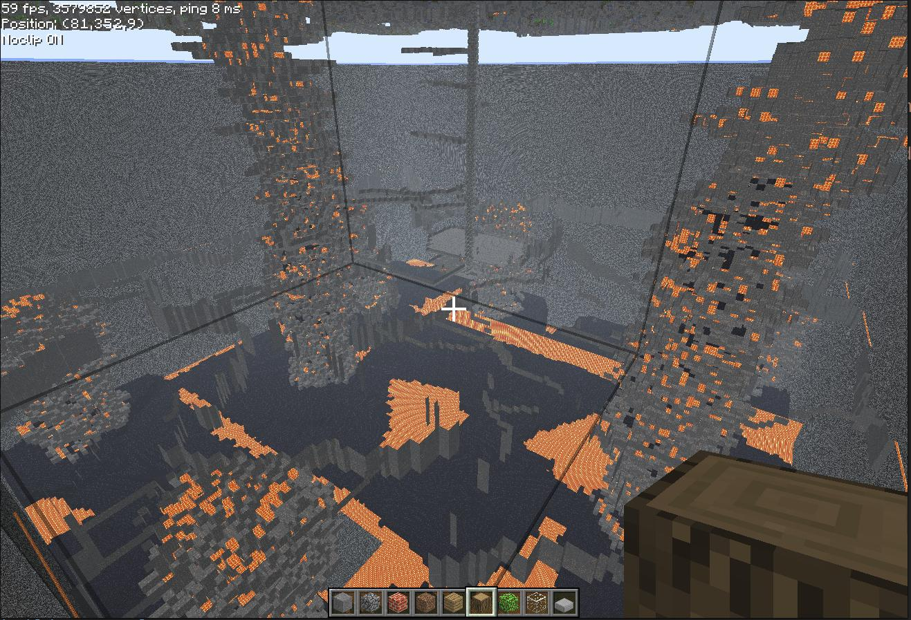

# DF Obsidian
Dwarf Fortress Map Renderer for [Project Obsidian](https://github.com/EdwardJXLi/ProjectObsidian).

## Installation

1. Install the `protobuf` library into your Python environment.
2. **Recursively** clone this repo into the `modules` subdirectory of your Project Obsidian installation.
3. Enter the cloned repository and run `cmake .` followed by `make`.
4. Create a file called `dfobsidian.py` in the `modules` directory of your Project Obsidian installation, with the contents `from .df_obsidian import DFObsidianModule`.
    * Needed pending directory-based module support in Project Obsidian.

## Usage

1. Run Dwarf Fortress with the `dfhack` plugin enabled.
    * All DF versions `>=0.47` are officially supported, including DF Premium. Versions `>=0.31` should work with minor tweaks. Mods are not supported, but may work.
    * For `dfhack` versions before 50.09-r3, You must reload your world every time you restart Project Obsidian, as `dfhack` will only send map updates about changed chunks.
2. Create a file called `default.df` in your Project Obsidian `worlds` directory with the contents `localhost:5555`.
    * This can be changed to any other host/port combination, with corresponding edits to DFHack configuration.
3. Edit ProjectObsidian's `configs/server.json` and set `"defaultSaveFormat": "DFObsidian"`.
4. Load it up!

## Roadmap

* User DF material information to better match materials in Minecraft.
    * Wood vs Mushroom
    * Glass Materials
    * Different Ores
* Buildings and multi-tile structures are not currently supported.
* Convert dwarves into Minecraft NPCs.
* Live update map to follow changes in Dwarf Fortress.
* Increase performance of loading maps.

## Additional Screenshots

